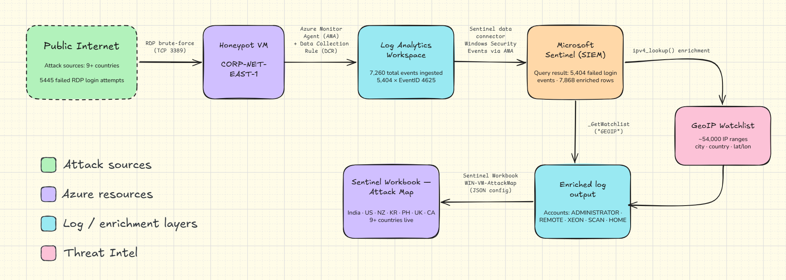
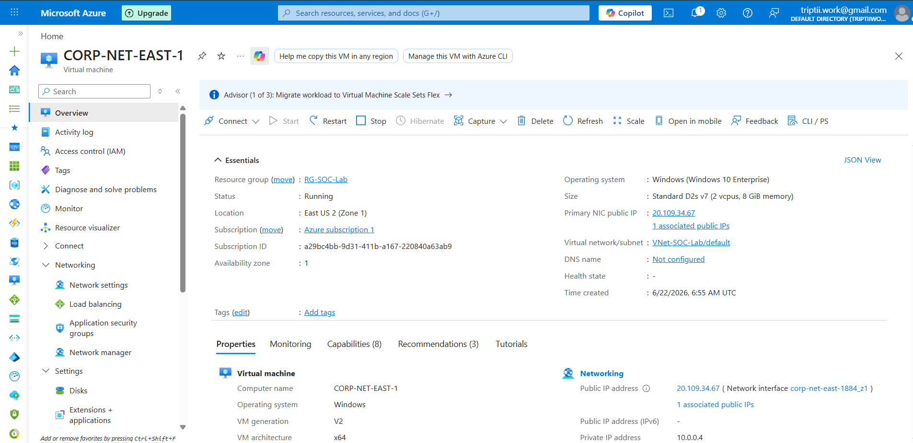
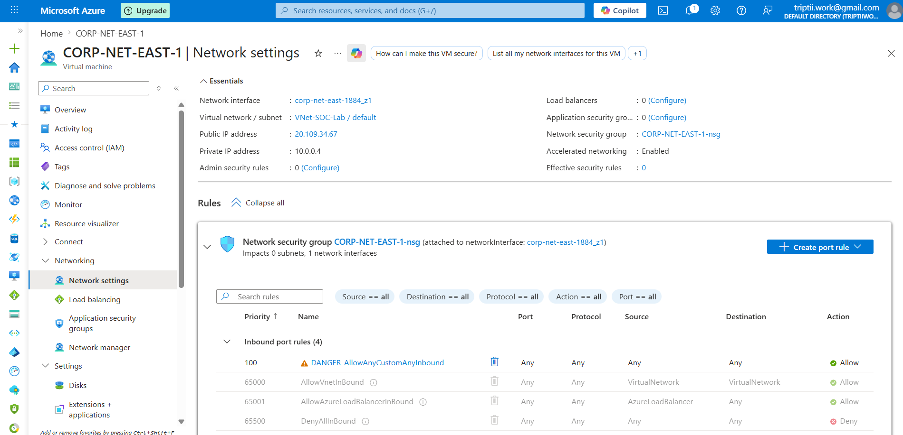
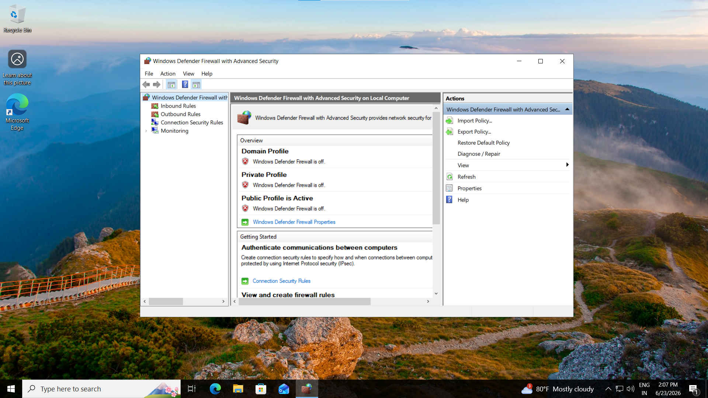
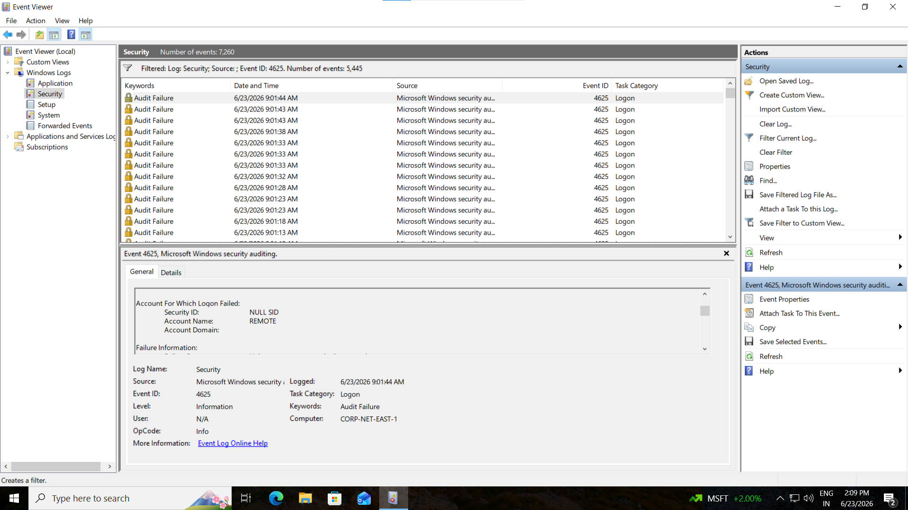
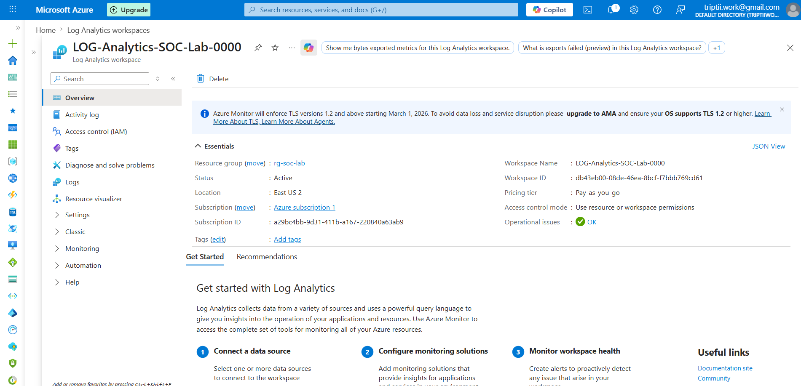
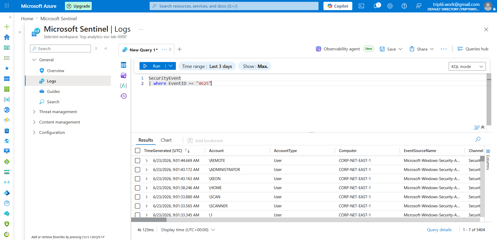
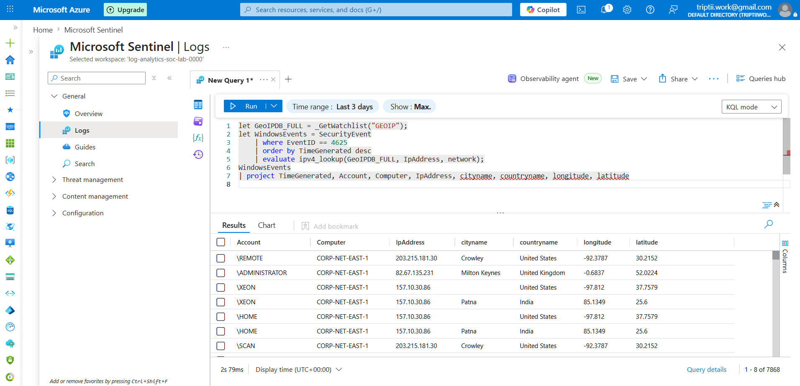
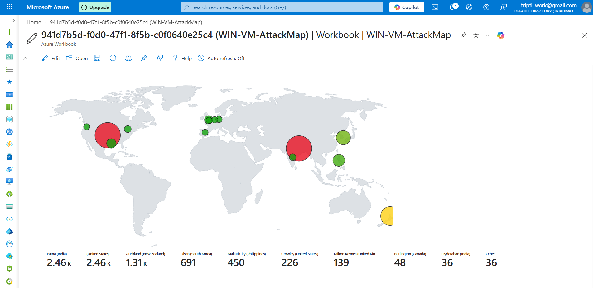

# Azure Sentinel Honeypot + Live Attack Map

## Overview

Deployed an intentionally exposed Windows 10 VM (`CORP-NET-EAST-1`) on Azure as a honeypot to capture and analyze real-world RDP brute-force activity. Security event logs were forwarded to Microsoft Sentinel via Log Analytics Workspace, enriched with geolocation data using a 54,000-row GeoIP watchlist, and visualized on a custom Sentinel Workbook attack map.

**Within approximately 24 hours of exposure, the VM logged 7,260 security events — 5,445 of which were failed RDP authentication attempts (Event ID 4625) originating from 9+ countries across 4 continents.**

This project demonstrates end-to-end SOC workflow: log ingestion → normalization → enrichment → threat visualization.
 

## Architecture

 

## Tech Stack

| Component | Tool / Service |
|-----------|---------------|
| Cloud Platform | Microsoft Azure |
| Honeypot Host | Azure VM — Windows 10 Enterprise (Standard D2s v7) |
| Network Exposure | NSG rule `DANGER_AllowAnyCustomAnyInbound` (priority 100) |
| Log Repository | Log Analytics Workspace (`LOG-Analytics-SOC-Lab-0000`) |
| SIEM | Microsoft Sentinel |
| Log Forwarding | Azure Monitor Agent (AMA) + Data Collection Rule |
| Query Language | KQL (Kusto Query Language) |
| IP Enrichment | Sentinel Watchlist — GeoIP (~54,000 IP network ranges) |
| Visualization | Sentinel Workbook (`WIN-VM-AttackMap`) |

 

## Implementation Steps

1. **Provisioned honeypot VM** — Windows 10 Enterprise on Azure (East US 2, Standard D2s v7). Assigned a static public IP (`20.109.34.67`).
2. **Disabled all NSG restrictions** — Created inbound rule `DANGER_AllowAnyCustomAnyInbound` (priority 100, all ports, all protocols, any source) to expose the VM fully to the internet.
3. **Disabled Windows Defender Firewall** — Turned off Domain, Private, and Public firewall profiles inside the VM to ensure no traffic filtering at the OS level.
4. **Configured log forwarding** — Installed Azure Monitor Agent on the VM; created a Data Collection Rule (DCR) to stream Windows Security Events to the Log Analytics Workspace.
5. **Connected Sentinel to LAW** — Enabled the "Windows Security Events via AMA" data connector in Microsoft Sentinel to begin ingesting logs.
6. **Validated ingestion via KQL** — Queried `SecurityEvent | where EventID == 4625` to confirm failed login events were appearing in Sentinel (returned 5,404 results over 3-day window).
7. **Imported GeoIP watchlist** — Loaded a 54,000-row IP-to-location CSV into Sentinel as a Watchlist (alias: `GEOIP`). Used `ipv4_lookup()` in KQL to enrich attacker IPs with city, country, and coordinates.
8. **Built attack map workbook** — Configured a custom Sentinel Workbook (`WIN-VM-AttackMap`) using JSON to render enriched log data as a geospatial bubble map with real-time attack volume by origin.
 

## Key Findings

| Metric | Value |
|--------|-------|
| Total security events logged | 7,260 |
| Failed login attempts (Event ID 4625) | 5,445 |
| Failed logins as % of total events | **75%** |
| Unique attack source countries | 9+ |
| Geo-enriched log rows | 7,868 |
| VM exposure time | ~24 hours |
| Targeted usernames observed | ADMINISTRATOR, REMOTE, XEON, HOME, SCAN, SCANNER, and others |

**Top attack sources by volume (from attack map):**

| Origin | Attempts |
|--------|----------|
| Patna, India | ~2,460 |
| United States | ~2,460 |
| Auckland, New Zealand | ~1,310 |
| Ulsan, South Korea | 691 |
| Makati City, Philippines | 450 |
| Crowley, United States | 226 |
| Milton Keynes, United Kingdom | 139 |
| Burlington, Canada | 48 |
| Hyderabad, India | 36 |
| Other | 36 |

 

## KQL Queries

See [`kql-queries/queries.md`](kql-queries/queries.md) for all queries with explanations.
 

## Observations & Analysis

See [`findings/observations.md`](findings/observations.md) for in-depth threat analysis.
 

## Screenshots

| Step | Preview |
|------|---------|
| VM Overview |  |
| NSG Inbound Rule (`DANGER_AllowAny`) |  |
| Firewall Disabled (all profiles) |  |
| Event Viewer — 5,445 × 4625 events |  |
| Log Analytics Workspace Active |  |
| Sentinel KQL — 5,404 failed logins |  |
| Geo-Enriched Logs (city + country) |  |
| Live Attack Map Workbook |  |

 

## Lessons Learned

- **Time-to-first-attack is measured in minutes, not hours.** An internet-exposed RDP endpoint is discovered and targeted by automated scanners almost immediately after provisioning.
- **Attack tooling is systematic, not random.** The username diversity observed (REMOTE, XEON, HOME, SCAN, SCANNER) points to structured wordlists used by credential stuffing frameworks, not opportunistic manual probing.
- **IP geolocation enrichment is the bridge between raw logs and actionable intelligence.** Without the GeoIP watchlist, the data is a list of IPs; with it, it becomes a threat picture with geographic patterns.
- **Multi-region attack distribution indicates botnet infrastructure.** Simultaneous high-volume hits from India, the US, New Zealand, Korea, and the Philippines within a single observation window suggest coordinated botnet nodes rather than a single actor.
- **KQL's `ipv4_lookup()` and `evaluate` operators are production-grade tools** — the same enrichment pattern used here scales directly to enterprise SIEM deployments.
 

## Next Steps / Potential Improvements

- **Automate incident creation** — Configure Sentinel Analytics Rules with a brute-force detection threshold (e.g., >10 failed logins from a single IP within 5 minutes) to auto-generate incidents.
- **Response automation** — Build a Logic App playbook triggered by Sentinel incidents to automatically block offending IPs via NSG API calls.
- **Threat intelligence correlation** — Cross-reference attacker IPs against threat intel feeds (MISP, VirusTotal API, Microsoft Defender TI) to identify known malicious actors.
- **Expand honeypot surface** — Deploy a Linux VM in parallel to compare SSH (port 22) vs RDP (port 3389) attack patterns across OS types.
- **UEBA baselining** — Enable Sentinel's User and Entity Behavior Analytics to establish baseline behavior and flag statistical anomalies in login patterns.

## Author

**Tripti Sharma**  
GitHub: [@triptiiSharma](https://github.com/triptiiSharma)

---

*This project documents the deployment of an Azure-based honeypot and SIEM environment for educational and cybersecurity research purposes.*